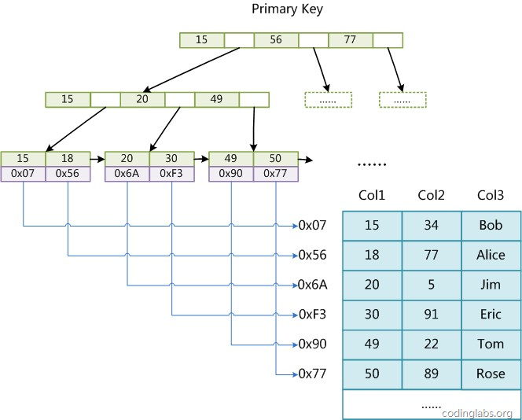

**Mysql索引概念：** 

说说Mysql索引，看到一个很少比如：索引就好比一本书的目录，它会让你更快的找到内容，显然目录（索引）并不是越多越好，假如这本书1000页，有500页是目录，它当然效率低，目录是要占纸张的,而索引是要占磁盘空间的。

**Mysql索引主要有两种结构：B+tree和hash.**

hash:hsah索引在mysql比较少用,他以把数据的索引以hash形式组织起来,因此当查找某一条记录的时候,速度非常快.当时因为是hash结构,每个键只对应一个值,而且是散列的方式分布.所以他并不支持范围查找和排序等功能.

B+树:b+tree是mysql使用最频繁的一个索引数据结构,数据结构以平衡树的形式来组织,因为是树型结构,所以更适合用来处理排序,范围查找等功能.相对hash索引,B+树在查找单条记录的速度虽然比不上hash索引,但是因为更适合排序等操作,所以他更受用户的欢迎.毕竟不可能只对数据库进行单条记录的操作.

**Mysql常见索引：**主键索引、唯一索引、普通索引、全文索引、组合索引

PRIMARY KEY（主键索引）  ALTER TABLE \`table_name\` ADD PRIMARY KEY ( \`column\` )

 UNIQUE(唯一索引)     ALTER TABLE \`table_name\` ADD UNIQUE (\`column\`)

INDEX(普通索引)     ALTER TABLE \`table\_name\` ADD INDEX index\_name ( \`column\` ) 

FULLTEXT(全文索引)      ALTER TABLE \`table_name\` ADD FULLTEXT ( \`column\` ) 

组合索引   ALTER TABLE \`table\_name\` ADD INDEX index\_name ( \`column1\`, \`column2\`, \`column3\` )

**Mysql各种索引区别：**

普通索引：最基本的索引，没有任何限制  
唯一索引：与"普通索引"类似，不同的就是：索引列的值必须唯一，但允许有空值。 

主键索引：它 是一种特殊的唯一索引，不允许有空值。

全文索引：仅可用于 MyISAM 表，针对较大的数据，生成全文索引很耗时好空间。 

组合索引：为了更多的提高mysql效率可建立组合索引，遵循”最左前缀“原则。

**B+Tree**

 

1. 所有关键字都在叶子结点出现

2. 所有叶子结点增加一个链指针

## 聚集索引和辅助索引、覆盖索引

- 聚集索引（主键索引）  

—innodb存储引擎是索引组织表，即表中的数据按照主键顺序存放。而聚集索引就是按照每张表的主键构造一颗B+树，同时叶子节点中存放的即为整张表的记录数据

—聚集索引的叶子节点称为数据页，数据页，数据页！重要的事说三遍。聚集索引的这个特性决定了索引组织表中的数据也是索引的一部分。

- 辅助索引（二级索引）  

—非主键索引

—叶子节点=键值+书签。Innodb存储引擎的书签就是相应行数据的主键索引值

- 覆盖索引

如果查询的列恰好是索引的一部分，那么查询只需要在索引文件上进行，不需要进行到磁盘中找数据，若果查询得列不是索引的一部分则要到磁盘中找数据

使用explain，可以通过输出的extra列来判断，对于一个索引覆盖查询，显示为**using index**,MySQL查询优化器在执行查询前会决定是否有索引覆盖查询

## 20101022补充

MyISAM

MyISAM引擎使用B+Tree作为索引结构，叶节点的data域存放的是数据记录的地址

MyISAM的索引文件仅仅保存数据记录的地址。在MyISAM中，主索引和辅助索引（Secondary key）在结构上没有任何区别，只是主索引要求key是唯一的，而辅助索引的key可以重复。

MyISAM中索引检索的算法为首先按照B+Tree搜索算法搜索索引，如果指定的Key存在，则取出其data域的值，然后以data域的值为地址，读取相应数据记录。

MyISAM的索引方式也叫做“非聚集”的

InnoDB

1.在InnoDB中，表数据文件本身就是按B+Tree组织的一个索引结构,叶节点data域保存了完整的数据记录

2.第二个与MyISAM索引的不同是InnoDB的辅助索引data域存储相应记录主键的值而不是地址,辅助索引搜索需要检索两遍索引：首先检索辅助索引获得主键，然后用主键到主索引中检索获得记录。

