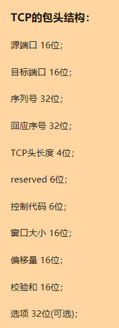
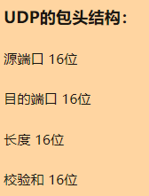
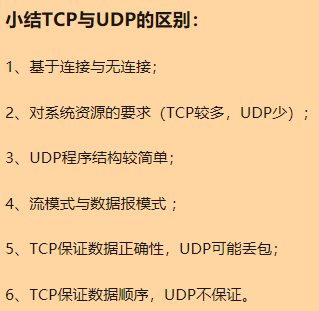

# 真实面试记录

## 1、redis hash 应用场景 
> hash类型是一个string类型的field和value的映射表，最大存储容量2的32次方 - 1 
```
key => [
	[field => value],
	...
]
```
> 参考：[https://www.cnblogs.com/pangzizhe/p/10657801.html](https://www.cnblogs.com/pangzizhe/p/10657801.html)

## 2、nginx 和 apache的区别 
```
nginx 异步，抗高并发，轻量级，高性能，负载均衡，配置简洁，高度模块化，反向代理
apache 阻塞，并发较差，稳定，丰富的特性和组件，成熟的社区，
```
*这里有一个疑问：‘网上经常看到说apache动态请求厉害，nginx更适合静态页面’，为什么呢？*
 > 参考：[https://www.cnblogs.com/ycgo/p/10915965.html](https://www.cnblogs.com/ycgo/p/10915965.html)

## 3、mysql慢查询如何查找 

设置几个配置项可以捕获并记录抵消SQL语句
```
// 这个参数设置为ON，可以捕获执行时间超过一定数值的SQL语句。
1、slow_query_log
// 当SQL语句执行时间超过此数值时，就会被记录到日志中，建议设置为1或者更短。
2、long_query_time
// 记录日志的文件名。
3、slow_query_log_file
// 这个参数设置为ON，可以捕获到所有未使用索引的SQL语句，尽管这个SQL语句有可能执行得挺快。
4、log_queries_not_using_indexes
```
> 参考：[https://www.cnblogs.com/qmfsun/p/4844472.html](https://www.cnblogs.com/qmfsun/p/4844472.html)

## 4、全文搜索 
sphinx elasticsearch

## 5、mysql大数据量加索引 
根据网上的资料，我总结一下：
将要加字段或索引的表结构复制一份，然后在空闲时，将原有数据导出到新表
不过这里我有一个想法，这种情况会突然出现在线上一个很大流量的功能上面吗？
基本的表结构变动，不应该是上线前已经定下来的吗？
换个思路想一下，我们是否非要在这张表上加（字段或索引）吗？比如创建个关联表这一类的解决方法呢？

> 参考：[https://blog.csdn.net/codererer/article/details/102806646](https://blog.csdn.net/codererer/article/details/102806646)

## 6、tcp udp区别 

\   |稳定性 |系统资源   |传输模式   |是否基于连接传输
---|---|---|---|---
TCP |保证数据正确性 |较多   |数据流 |基于连接传输
UDP |可能丢包   |少 |数据报 |无连接

TCP是稳定传输，稳定，略慢

UDP是不稳定传输，不稳定，速度快
> 



> 参考：[https://zhuanlan.zhihu.com/p/24860273](https://zhuanlan.zhihu.com/p/24860273)

## 7、php的垃圾回收

1、一个变量的refcount（引用计数）减少到0，这个变量不属于垃圾。

2、反之，如果一个减少后仍大于0，则这个变量有可能成为一个垃圾，同时进入垃圾周期，此时会被放到一个缓冲区，等待满足一定数量时（或许是10000？）再统一进行处理。

3、在一个垃圾周期中，通过检查引用计数减一后，是否为0（来排除自身引用），为0，则当成垃圾回收。

4、若不为0，那么恢复引用次数，并从缓冲区移出。

## 8、php请求的执行流程

1、模块初始化阶段

2、请求初始化阶段

3、执行php脚本阶段

4、请求结束阶段

5、模块关闭阶段

## 9、laravel的请求流程

1、初始化容器

2、加载内置服务提供者

3、路由

4、控制器

5、执行脚本代码

5、response

## Git回滚代码到某个commit

回退命令：
```
// 回退到上个版本
~$ git reset --hard HEAD^	

// 回退到前3次提交之前，以此类推，回退到n次提交之前
~$ git reste --hard HEAD~3	

// 回退/前进 到指定commit的sha码
~$ git reset --hard commit_id	
```

## 设计模式

> 设计模式的初衷是什么？

> 是抽象化

常用的设计模式：

- 单例模式
- 观察者模式
- 抽象工厂模式

> 不要滥用设计，没有最好的，只有最适合的，不要被设计模式限制了想象，没有一成不变的设计
