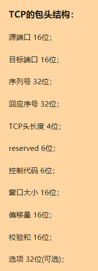
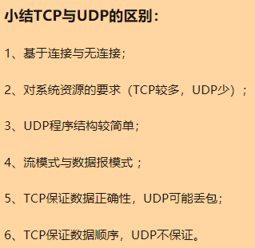

# 真实面试记录

## 1、redis hash 应用场景 
> hash类型是一个string类型的field和value的映射表，最大存储容量2的32次方 - 1 
```
key => [
	[field => value],
	...
]
```
> 参考：[https://www.cnblogs.com/pangzizhe/p/10657801.html](https://www.cnblogs.com/pangzizhe/p/10657801.html)

## 2、nginx 和 apache的区别 
```
nginx 异步，抗高并发，轻量级，高性能，负载均衡，配置简洁，高度模块化，反向代理
apache 阻塞，并发较差，稳定，丰富的特性和组件，成熟的社区，
```
*这里有一个疑问：‘网上经常看到说apache动态请求厉害，nginx更适合静态页面’，为什么呢？*
 > 参考：[https://www.cnblogs.com/ycgo/p/10915965.html](https://www.cnblogs.com/ycgo/p/10915965.html)

## 3、mysql慢查询如何查找 

设置几个配置项可以捕获并记录抵消SQL语句
```
// 这个参数设置为ON，可以捕获执行时间超过一定数值的SQL语句。
1、slow_query_log
// 当SQL语句执行时间超过此数值时，就会被记录到日志中，建议设置为1或者更短。
2、long_query_time
// 记录日志的文件名。
3、slow_query_log_file
// 这个参数设置为ON，可以捕获到所有未使用索引的SQL语句，尽管这个SQL语句有可能执行得挺快。
4、log_queries_not_using_indexes
```
> 参考：[https://www.cnblogs.com/qmfsun/p/4844472.html](https://www.cnblogs.com/qmfsun/p/4844472.html)

## 4、全文搜索 
sphinx elasticsearch

## 5、mysql大数据量加索引 
根据网上的资料，我总结一下：
将要加字段或索引的表结构复制一份，然后在空闲时，将原有数据导出到新表
不过这里我有一个想法，这种情况会突然出现在线上一个很大流量的功能上面吗？
基本的表结构变动，不应该是上线前已经定下来的吗？
换个思路想一下，我们是否非要在这张表上加（字段或索引）吗？比如创建个关联表这一类的解决方法呢？

> 参考：[https://blog.csdn.net/codererer/article/details/102806646](https://blog.csdn.net/codererer/article/details/102806646)

## 6、tcp udp区别 

\   |稳定性 |系统资源   |传输模式   |是否基于连接传输
---|---|---|---|---
TCP |保证数据正确性 |较多   |数据流 |基于连接传输
UDP |可能丢包   |少 |数据报 |无连接

TCP是稳定传输，稳定，略慢

UDP是不稳定传输，不稳定，速度快
> 



> 参考：[https://zhuanlan.zhihu.com/p/24860273](https://zhuanlan.zhihu.com/p/24860273)

## 7、php的垃圾回收

1、一个变量的refcount（引用计数）减少到0，这个变量不属于垃圾。

2、反之，如果一个减少后仍大于0，则这个变量有可能成为一个垃圾，同时进入垃圾周期，此时会被放到一个缓冲区，等待满足一定数量时（或许是10000？）再统一进行处理。

3、在一个垃圾周期中，通过检查引用计数减一后，是否为0（来排除自身引用），为0，则当成垃圾回收。

4、若不为0，那么恢复引用次数，并从缓冲区移出。

## 8、php请求的执行流程

1、模块初始化阶段

2、请求初始化阶段

3、执行php脚本阶段

4、请求结束阶段

5、模块关闭阶段

## 9、laravel的请求流程

1、初始化容器

2、加载内置服务提供者

3、路由

4、控制器

5、执行脚本代码

5、response

## 10、Git回滚代码到某个commit

回退命令：
```
// 回退到上个版本
~$ git reset --hard HEAD^	

// 回退到前3次提交之前，以此类推，回退到n次提交之前
~$ git reste --hard HEAD~3	

// 回退/前进 到指定commit的sha码
~$ git reset --hard commit_id	
```

## 11、设计模式

> 设计模式的初衷是什么？

> 是抽象化

常用的设计模式：

- 单例模式
- 观察者模式
- 抽象工厂模式

> 不要滥用设计，没有最好的，只有最适合的，不要被设计模式限制了想象，没有一成不变的设计

## 12、主从数据库同步延迟问题

- 为什么会延迟？

MySQL的主从复制都是单线程的操作，主库对所有DDL和DML产生的日志写进binlog，由于binlog是顺序写，所以斜率很发哦。Slave的SQLThread线程将主库的DDL和DML操作时间在slave中重放。DML和DDL的IO操作是随机的，不是顺序的，成本高很多。另一方面，由于SQL Thread也是单线程的，当主库的并发较高时，产生的DML数量超过slave的SQL Thread所能处理的速度，或者当slave中有大型query语句产生了所等待，那么延时就产生了。

> 名词解释：
```
SQL语言共分为四大类：查询语言DQL，控制语言DCL，操纵语言DML，定义语言DDL。

DQL：可以简单理解为SELECT语句；

DCL：GRANT、ROLLBACK和COMMIT一类语句；

DML：可以理解为CREATE一类的语句；

DDL：INSERT、UPDATE和DELETE语句都是；
```
- 常见原因及解决方案

常见原因	|解决方案
---	|---
1、网络延时	|1、优化网络
2、Master/Slave 负载过高，机器性能太低	|2、升级硬件配置
3、Mysql配置不合理	|3、Slave调整参数，关闭binlog，修改innodb_flush_log_at_trx_commit参数值

> 配置解释：
```
sync_binlog的默认值是0，MySQL不会将binlog同步到磁盘，其值表示每写多少binlog同步一次磁盘。

innodb_flush_log_at_trx_commit为1表示每一次事务提交或事务外的指令都需要把日志flush到磁盘。
```

> 可以做到不延迟吗？

可以，像是：

- 引入中间数据层（推荐：新插入的数据走redis这种第三方，设立失效时间，同步之前取数据走这里）
- 半同步复制（确保有一个从库同步数据，然后主库在返回）（不推荐：牺牲性能）
- mysql并行复制  
	- 社区版5.6中新增  
	- 并行是指从库多线程apply binlog  
	- 库级别并行应用binlog
	-同一个库数据更改还是串行的(5.7版并行复制基于事务组)，设置set global slave_parallel_workers=10;设置sql线程数为10

从数据库方面没有绝对的不延迟（不影响性能的情况下），只能考虑在业务上，去平衡，去引入第三方，增加机器配置。

> 参考链接：[https://www.cnblogs.com/phpper/p/8904169.html](https://www.cnblogs.com/phpper/p/8904169.html)
[https://blog.csdn.net/hao_yunfeng/article/details/82392261](https://blog.csdn.net/hao_yunfeng/article/details/82392261)

## 13、反爬虫

- 验证码
- 限制频率（根据IP，Cookie）
- 根据header头信息过滤（Cookie，Referer，User-Agent...）
> http header：[https://blog.csdn.net/m0_37730732/article/details/82263609](https://blog.csdn.net/m0_37730732/article/details/82263609)
- 前端异步加载、懒加载


> Swoole简介
swoole是一个php扩展，使用纯c语言开发。
swoole是一个网络通信和异步io的引擎，一个基础库。
为php提供了之前没有的一些高级特性，如：异步，并行，TCP/UDP网络编程，常驻内存

最大的亮点是协程（即用户态线程）
和多线程不同，系统切换线程/进程，都会有损耗开销，而且是时间片切换（即每个任务执行一段时间就切换到另一个任务），
而协程则是在单线程内，遇到阻塞即挂起协程，把cpu让给其他协程执行任务，提升单线程的cpu资源利用率，从而提高性能。

## 14、swoole网络模型

Master-Mannger-worker

（1个Master进程+1个Manager进程+2个Worker进程+1个Task进程）
> 参考链接：

> [https://www.cnblogs.com/JsonM/articles/7325001.html](https://www.cnblogs.com/JsonM/articles/7325001.html)

> [https://wiki.swoole.com/#/server/init?id=reactor%E7%BA%BF%E7%A8%8B](https://wiki.swoole.com/#/server/init?id=reactor%E7%BA%BF%E7%A8%8B)

## 15、swoole进程通信

> 投递任务

Swoole提供了5种dispatch方式。通过Server::set方法设置dispatch_mode来配置。

- 轮询模式

dispatch_mode = 1 

收到的请求数据包会轮询发到每个Worker进程。

- FD取模

dispatch_mode = 2

数据包根据fd的值%worker_num来分配，这个模式可以保证一个TCP客户端连接发送的数据总是会被分配给同一个worker进程。 这种模式可能会存在性能问题，作为SOA服务器时，不应当使用此模式。因为客户端很可能用了连接池，客户端100个进程复用10个连接，也就是同时只有10个swoole worker进程在处理请求。这种模式的业务系统可以使用dispatch_mode = 3，抢占式分配。

- 忙闲分配

dispatch_mode = 3 

此模式下，Reactor只会给空闲的Worker进程投递数据。 这个模式的缺点是，客户端连接对应的Worker是随机的。不确定哪个Worker会处理请求。无法保存连接状态。 当然也可以借助第三方库来实现保存连接状态和会话内容，比如apc/redis/memcache。

- IP 取模

dispatch_mode = 4

如果客户端的连接不稳定，经常发生断线重连，fd的值不是固定的，使用IP进行取模分配可以解决此问题。同一个IP地址会被分配到同一个Worker进程。

- UID 取模

dispatch_mode = 5

与fd或IP取模分配一致，dispatch_mode = 5 需要应用层调用bind方法设置一个UID

> Stream 模式

使用类似于php-fpm的Unix Socket短连接方式通信，Worker进程会变成Leader-Follower模式，争抢任务。

## 16、elasticsearch 全文搜索，一切设计都是为了提高搜索的性能

分布式部署（多节点）

文档分词（分词器）
> es自带的英文分词器 (这里列出常用的几个)：Standard Analyzer、Simple Analyzer、whitespace Analyzer
>
> 中文分词器：IK(最常用)、smartCN、HanLP

倒排索引（检索顺序：Term Index -> Term Dictionary -> Losting List）

- 倒排索引名词解释：

> Term（单词）：一段文本经过分析器分析以后就会输出一串单词，这一个一个的就叫做Term（直译为：单词）

> Term Dictionary（单词字典）：顾名思义，它里面维护的是Term，可以理解为Term的集合

> Term Index（单词索引）：为了更快的找到某个单词，我们为单词建立索引

> Posting List（倒排列表）：倒排列表记录了出现过某个单词的所有文档的文档列表及单词在该文档中出现的位置信息，每条记录称为一个倒排项(Posting)。根据倒排列表，即可获知哪些文档包含某个单词。
>
> PS：实际的倒排列表中并不只是存了文档ID这么简单，还有一些其它的信息，比如：词频（Term出现的次数）、偏移量（offset）等，可以想象成是Python中的元组，或者Java中的对象
>
> PS：如果类比现代汉语词典的话，那么Term就相当于词语，Term Dictionary相当于汉语词典本身，Term Index相当于词典的目录索引

参考文章：

http://note.youdao.com/noteshare?id=4367bc2bc4f4e145675ece8bf7002dce&sub=wcp1596004570843753

http://note.youdao.com/noteshare?id=94ba59880cbeee68c0732fb6890a5eb8&sub=wcp1596002888977515