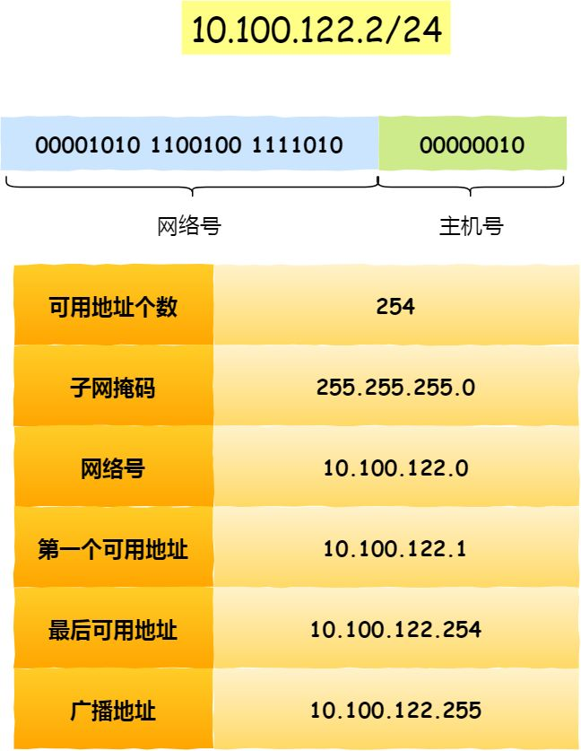

<!--
// 内容折叠显示
<details>
    <summary><mark><font color=darkred>查看更多</font></mark></summary>
    ...内容...    
</details>
-->

> ## 2022.12.02 - `slice` 切片扩容机制
<details>
    <summary><mark><font color=darkred>查看更多</font></mark></summary>

- 少于1024双倍扩容
- 大于1024
    - (长度)*(1.25倍扩容，批量append时不乘该值)*(元素类型大小，如int64为8byte)
    - 然后去内存分配表(runtime/sizeclasses.go)查找大于并且最接近的内存增长分配值
    - 内存增长分配值/类型大小=扩容后的容量
    
- 一个一个append
  - 1024 * 1.25 * 4 = 5120 查表 5376/4 = 1344
  - 1024 * 1.25 * 8 = 10240 查表 10240/8 = 1280
    
- 批量append
  - 1025 * 8 = 8200 查表 9472/8 = 1184

</details>

> ## 2022.10.19 - `sync.Map` 使用注意事项
<details>
    <summary><mark><font color=darkred>查看更多</font></mark></summary>

> 介绍

- 一句话总结：`为并发安全而生的map类型（原生map不支持并发读写）`
    ```
    sync.Map类似于一个map[interface{}]interface{}的map结构，但不同之处在于它本身实现了并发安全
    
    在没有并发需求的时候，比如局部变量，推荐都用map替代sync.Map.这么做有几点好处：
      1、类型安全，局部变量更好控制类型，甚至可以定义特定类型，无需assert强转。var s = x.(T)
      2、读写都可控，不涉及到锁，性能更好
    
    适用场景：
      1、多个goroutine并发对同一个map读写操作，sync.Map并发安全，且性能优于原生map+互斥锁 或读写锁
      2、读多写少，一次写入，多次读取
    ```

> 使用建议

- 避免多层`sync.Map`嵌套使用，如：`sync.Map<key,sync.Map>`
    - 为什么？
        - 1：增加维护难度
        - 2：每层value都需要强转，类型安全问题

> 遇到的问题：

- 操作原子性
    - 前置条件
        - `多核心并发时`
        - `runtime.GOMAXPROCS(1)`单核没有出现该问题
    - `多核并发`操作同一个sync.Map，会产生多次写入的问题
    - sync.Map Load/Store 只是并发安全（不会 panic），但并不保证操作的原子性
      ```
        代码示例： 
        ··· 
        var amap sync.Map 
        for i := 0; i < 100; i++ { 
            go func() { 
              tmp, ok := amap.Load("only")
              if ok { 
                  fmt.Println("已有值：", tmp)
              } else { 
                val := rand.Intn(10000)
                amap.Store("only", val)
                fmt.Println("写入值：", val)
              } 
            }()
        } 
        time.Sleep(time.Second * 10)
      ```
    - 怎么解决： `使用LoadOrStore方法存储`
        - 细节： `sync.Map中的tryLoadOrStore是原子操作，LoadOrStore使用其实现`
      ```
      代码示例：
      ···
      var amap sync.Map
      for i := 0; i < 100; i++ {
          go func() {
              val := rand.Intn(10000)
              tmp, loaded := amap.LoadOrStore("only",val)
              if loaded {
                  fmt.Println("已有值：", tmp)
              } else {
                  fmt.Println("写入值：", val)
              }
          }()
      }
      time.Sleep(time.Second * 10)
      ```

引用文章：https://zhuanlan.zhihu.com/p/402173031

</details>

> ## 2022.08.02 - `sync.Pool`（内存池） golang性能提升利器
<details>
    <summary><mark><font color=darkred>查看更多</font></mark></summary>

> [sync.Pool(点击查看详细)](./my/golang/sync_pool)是什么呢？

sync.pool是Go1.3发布的一个特性，它是一个临时对象存储池

> 为什么需要sync.pool呢

- 一句话总结：`保存和复用临时对象，减少内存分配，降低GC压力`
    - 代码中频繁的创建对象和回收内存，造成了GC的压力；
    - 而sync.pool可以缓存对象暂时不用但是之后会用到的对象，并且不需要重新分配内存；
    - 这在很大程度上降低了GC的压力，并且提高了程序的性能

> 注意点

- 每次 `Get` 获取的对象，使用前需要重置
    - 注意将使用完的对象 `Put` 回对象池
        - 有 `Get` , `Put` 才是一个完整的生命周期，如果只取不存，那这组件不是白用了嘛

> 遇到的问题

- golang `-race` 与 `sync.Pool` 冲突
    - 环境：
        - 在编译时启用数据竞争检测（race data check） `-race`
          ```shell
          go build -race main.go
          ```
    - 问题：
        - `sync.Pool`一直在创建资源（New）
    - 为什么产生？
        - `寻找答案中。。。`

</details>

> ## 2022.07.20 - linux系统下，进程莫名被进程杀掉
<details>
    <summary><mark><font color=darkred>查看更多</font></mark></summary>

- 原因：

    - 进程被系统杀掉，内存不够
        - `free -lm` 命令查看实际内存大小（实际和虚拟）
    - 排查过程
        - 一直以为是程序问题，排查了代码没有发现异常，而且日志、命令行输出也全部没有。
        - 每次服务连接失败时，`ps -ef | grep 进程名` 查看进程都没有找到，通过网上搜索可能是linux系统把进程杀掉了。
        - 查看被系统杀掉进程日志的命令：  `egrep -i -r 'killed process' /var/log` （只有root权限才可以查看），
        - 发现确实有被杀掉的进程，而且时间也对的上，到这知道原来是linux杀掉的进程。
        - 后来通过了解，linux 会检测内存的变化，如果发现内存使用过大的进程，会被杀掉，保护系统正常运行。

- 解决：

    - [设置虚拟内存](./my/linux/swap.md)

</details>

> ## 2022.01.07 - [配置nginx文件服务下载](http://note.youdao.com/noteshare?id=2ba9623ee8621809d2541f232f1f5726&sub=857211A2DB25449582074136DD924FA1)

> ## 2021.09.23 - 解决nginx转发websocket请求连接失败的问题
<details>
    <summary><mark><font color=darkred>查看更多</font></mark></summary>

- 修改对应的nginx conf文件

```
server
{
    ···
    
    location /
    {
        // 加上下面这两行代码，websocket连接就可以了
        // 没有深入探究，可能是转发时把部分头信息丢了？
        proxy_set_header Upgrade $http_upgrade;
        proxy_set_header Connection "upgrade";
        proxy_pass http://127.0.0.1:8000;
    }
    
   ···
}
```

</details>


> ## 2021.10.17 - [安装manjaro常用软件](./my/manjaro/software.md)

> ## 2021.10.17 - [Prometheus监控](./my/prometheus/prometheus.md)

> ## 2021.09.23 - Rabbitmq
<details>
    <summary><mark><font color=darkred>查看更多</font></mark></summary>

- [rabbitmq延时消息的原理及实现](http://note.youdao.com/noteshare?id=fb75e1177ffaa53593214ea415405106&sub=47355B80A0D84224A1A88D4365C289E8)
- [rabbitmq核心概念](http://note.youdao.com/noteshare?id=b64b9c624838aa0370ecf19f9213e868&sub=wcp1626661769638165)
- [rabbitmq各个参数](http://note.youdao.com/noteshare?id=6cecdcf8dc98f23b2cf1253be8f0b490&sub=8214D8AB92E84A43B8CEA74C8C349560)
- [rabbitmq如何保证消息不丢失](http://note.youdao.com/noteshare?id=ce92a54f672faa4f6324e73aa85f7402&sub=AB135FF24D444B9AAA6DD07515B69E85)

</details>

> ## 2021.08.04 - [Golang string类型和[]byte类型的对比](./my/golang/string_byte)

> ## 2021.08.03 - Go 单元测试

<details>
    <summary><mark><font color=darkred>查看更多</font></mark></summary>

- Go语言拥有一套单元测试和性能测试系统，仅需要添加很少的代码就可以快速测试一段需求代码。
- go test 命令，会自动读取源码目录下面名为 *_test.go 的文件，生成并运行测试用的可执行文件。

这里介绍几个常用的参数：

```
-bench regexp : 性能测试，支持表达式对测试函数进行筛选。`-bench .` 则是对所有的benchmark函数测试;
-run regexp : 只运行 regexp 匹配的函数，例如 `-run=Array` 那么就执行包含有 Array 开头的函数；
-benchmem:性能测试的时候显示测试函数的内存分配的统计信息
-cover : 开启测试覆盖率；
-v : 显示测试的详细信息;
-count=1 : 禁用测试缓存; 
```

> 参考文章
[go Test Benchmark 性能测试](https://blog.csdn.net/luolianxi/article/details/105458889)
</details>

> ## 2021.07.27 - Golang中的包循环导入错误(import cycle not allowed)
<details>
    <summary><mark><font color=darkred>查看更多</font></mark></summary>

- 在go开发中,使用import导入相应包时,有时会碰到 `import cycle not allowed` 这个错误
- 错误产生的原因在于,你导入的包和你当前的包,互相导入(依赖)
- 这里举一个例子:

`Test/A`

```
package A

import "Test/B"
```

`Test/B`

```
package B

import "Test/A"
```

- 这里发生了什么?
    - A导入B
    - B又导入A
    - 致使两个包相互依赖,互相导入,从而出现 `import cycle not allowed` 这个错误
- 解决办法
    - 做好项目的包规划,有冲突的引用方法新建一个包,解决循环导入的错误
    - 网上有通过 `interface(接口)` 的方法解决这个问题,但我认为这样增加了复杂度,将简单的问题复杂化了

</details>

> ## 2021.07.20 - [Hyperf框架grpc实现](./my/sourceAnalysis/hyperf-grpc)

> ## 2021.01.07 - /etc/init.d和/etc/rc.d/rc.local的区别
<details>
  <summary><mark><font color=darkred>查看更多</font></mark></summary>

- /etc/init.d 是一个目录（这个目录里面用于放置shell脚本，注意是脚本）：
    - 是/etc/rc.d/init.d的软链接
    - 这些脚本是启动脚本，用于Linux中服务的启动、停止、重启
    - 比如各种Linux中的服务都会有启动脚本放在这里，像是ssh服务的文件sshd，nginx、php-fpm的启动文件
- /etc/rc.d/rc.local 是一个文件（这个文件用于用户自定义开机启动程序）
    - 也就是说用户可以把需要开机启动的命令、运行可执行脚本的命令写入这个文件，这样就可以在系统启动时自动执行这个命令
    - 比如把一个shell脚本的完整路径写入这个文件，那这个shell脚本就会在开机后自动执行

- 为了方便理解，这里我们放一个详细介绍Linux启动流程的链接
    - [进去看看](./my/knowledgePoint/linuxStartProcessFlow)

</details>

> ## 2021.01.06 - [安装supervisor（及产生的问题）](./interview/linux?id=安装Supervisor)

> ## 2020.10.29 - v2rayN报错

<details>
  <summary><mark><font color=darkred>查看更多</font></mark></summary>

- 报错内容：

    ```
    failed to read response header > websocket: close 1000 (normal)
    ```
- 错误原因：系统时间与服务器时间不一致
- 解决办法：校准系统时间

</details>

> ## 2020.10.27 - windows docker xshell 默认登录密码

<details>
  <summary><mark><font color=darkred>查看更多</font></mark></summary>

- boot2docker用户和密码

| 用户    | 密码   | 进入方式 |
|--------|--------|------|
| docker | tcuser | ssh  |
| root   |        | command：sudo -i (docker用户下执行)  |

</details>

> ## 2020.09.23 - [redis持久化](./interview/redis?id=持久化)

> ## 2020.09.15 - [redis哨兵选举master策略](./interview/redis?id=哨兵选举策略)

> ## 2020.09.14 - [redis哨兵模式](./interview/redis?id=哨兵配置)

> ## 2020.09.11 - [redis主从配置](./interview/redis?id=主从配置)

> ## 2020.09.09 - [docker环境下elasticsearch集群部署（单机模拟）](./interview/elasticsearch?id=docker环境下集群部署（单机模拟）)

> ## 2020.09.08 - [MySQLd启动命令](./interview/mysql/mysql?id=mysqld启动命令)

> ## 2020.09.07 - MySQL主从

<details>
  <summary><mark><font color=darkred>查看更多</font></mark></summary>

- MySQL主从服务器配置
    - MySQL版本：8.0.21
    - [主从同步的机制](./interview/mysql/mysql?id=数据库主从复制原理)
    - [步骤](./interview/mysql/mysql?id=主从复制操作)

</details>

> ## 2020.09.03 - 无分类地址 CIDR 10.100.122.2/24

<details>
  <summary><mark><font color=darkred>查看更多</font></mark></summary>

- 无分类地址 CIDR

  正因为 IP 分类存在许多缺点，所以后面提出了无分类地址的方案，即 CIDR。

  这种方式不再有分类地址的概念，32 比特的 IP 地址被划分为两部分，前面是网络号，后面是主机号。

  “ 怎么划分网络号和主机号的呢？ ” 表示形式 a.b.c.d/x，其中 /x 表示前 x 位属于网络号， x 的范围是 0 ~ 32，这就使得 IP 地址更加具有灵活性。

  比如 10.100.122.2/24，这种地址表示形式就是 CIDR，/24 表示前 24 位是网络号，剩余的 8 位是主机号。

  

</details>

> ## 2020.09.02 - firewalld进程不能启动

<details>
  <summary><mark><font color=darkred>查看更多</font></mark></summary>

- firewalld进程启动不了（报错超时）[参考链接](https://blog.csdn.net/crynono/article/details/76132611)

    - 报错信息如下
    ```
    [root@VM_0_6_centos ~]#  systemctl status firewalld 
    ● firewalld.service - firewalld - dynamic firewall daemon
    Loaded: loaded (/usr/lib/systemd/system/firewalld.service; disabled; vendor preset: enabled)
    Active: failed (Result: timeout) since Wed 2020-09-02 10:19:58 CST; 4s ago
        Docs: man:firewalld(1)
    Process: 31626 ExecStart=/usr/sbin/firewalld --nofork --nopid $FIREWALLD_ARGS (code=exited, status=0/SUCCESS)
    Main PID: 31626 (code=exited, status=0/SUCCESS)

    Sep 02 10:18:28 VM_0_6_centos systemd[1]: Starting firewalld - dynamic firewall daemon...
    Sep 02 10:18:28 VM_0_6_centos firewalld[31626]: WARNING: AllowZoneDrifting is enabled. This is considered an insecure configuration option. It will be removed in a future release. Please consider disabling it now.
    Sep 02 10:19:58 VM_0_6_centos systemd[1]: firewalld.service start operation timed out. Terminating.
    Sep 02 10:19:58 VM_0_6_centos systemd[1]: Failed to start firewalld - dynamic firewall daemon.
    Sep 02 10:19:58 VM_0_6_centos systemd[1]: Unit firewalld.service entered failed state.
    Sep 02 10:19:58 VM_0_6_centos systemd[1]: firewalld.service failed.

    ```
- 执行以下命令后，恢复running：
    ```
    systemctl stop firewalld;pkill -f firewalld;systemctl start firewalld
    ```
    - 对于该解决方法，网上的解释
    ```
    该方法参考来源：

    http://centosfaq.org/centos/centos-7-firewalldservice-operation-time-out-systemctl-firewalld-issues/

    来自官方的faq,给了一些解释： systemd didn’t know about the process that it didn’t start in the first place of course
    ```

</details>

> ## 2020.09.01 - Temporary failure in name resolution 错误解决方法

<details>
  <summary><mark><font color=darkred>查看更多</font></mark></summary>

- 问题产生： DNS服务器地址失效

- 解决： 更换新的DNS服务器地址

```
/etc/resolv.conf // 它是DNS客户机配置文件，用于设置DNS服务器的IP地址及DNS域名
nameserver 202.102.192.68
```

</details>
