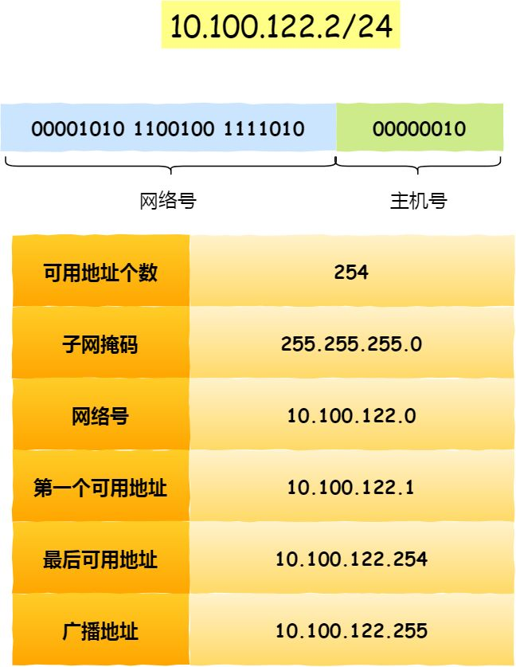

> ## 2020.9.8-MySQLd启动命令
- [启动命令](../../interview/mysql/mysql?id=mysqld启动命令)

> ## 2020.9.7-MySQL主从

- MySQL主从服务器配置
    - MySQL版本：8.0.21
    - [主从同步的机制](../../interview/mysql/mysql?id=数据库主从复制原理)
    - [步骤](../../interview/mysql/mysql?id=主从复制操作)

> ## 2020.9.3-10.100.122.2/24

- 无分类地址 CIDR

    正因为 IP 分类存在许多缺点，所以后面提出了无分类地址的方案，即 CIDR。

    这种方式不再有分类地址的概念，32 比特的 IP 地址被划分为两部分，前面是网络号，后面是主机号。

    “ 怎么划分网络号和主机号的呢？
    ”
    表示形式 a.b.c.d/x，其中 /x 表示前 x 位属于网络号， x 的范围是 0 ~ 32，这就使得 IP 地址更加具有灵活性。

    比如 10.100.122.2/24，这种地址表示形式就是 CIDR，/24 表示前 24 位是网络号，剩余的 8 位是主机号。

    

> ## 2020.9.2-firewalld进程不能启动

- firewalld进程启动不了（报错超时）[参考链接](https://blog.csdn.net/crynono/article/details/76132611)
    
    - 报错信息如下
    ```
    [root@VM_0_6_centos ~]#  systemctl status firewalld 
    ● firewalld.service - firewalld - dynamic firewall daemon
    Loaded: loaded (/usr/lib/systemd/system/firewalld.service; disabled; vendor preset: enabled)
    Active: failed (Result: timeout) since Wed 2020-09-02 10:19:58 CST; 4s ago
        Docs: man:firewalld(1)
    Process: 31626 ExecStart=/usr/sbin/firewalld --nofork --nopid $FIREWALLD_ARGS (code=exited, status=0/SUCCESS)
    Main PID: 31626 (code=exited, status=0/SUCCESS)

    Sep 02 10:18:28 VM_0_6_centos systemd[1]: Starting firewalld - dynamic firewall daemon...
    Sep 02 10:18:28 VM_0_6_centos firewalld[31626]: WARNING: AllowZoneDrifting is enabled. This is considered an insecure configuration option. It will be removed in a future release. Please consider disabling it now.
    Sep 02 10:19:58 VM_0_6_centos systemd[1]: firewalld.service start operation timed out. Terminating.
    Sep 02 10:19:58 VM_0_6_centos systemd[1]: Failed to start firewalld - dynamic firewall daemon.
    Sep 02 10:19:58 VM_0_6_centos systemd[1]: Unit firewalld.service entered failed state.
    Sep 02 10:19:58 VM_0_6_centos systemd[1]: firewalld.service failed.

    ```
- 执行以下命令后，恢复running：
    ```
    systemctl stop firewalld;pkill -f firewalld;systemctl start firewalld
    ```
    - 对于该解决方法，网上的解释
    ```
    该方法参考来源：

    http://centosfaq.org/centos/centos-7-firewalldservice-operation-time-out-systemctl-firewalld-issues/

    来自官方的faq,给了一些解释： systemd didn’t know about the process that it didn’t start in the first place of course
    ```

> ## 2020.9.1

- Temporary failure in name resolution 错误解决方法

    ```
    # 问题产生：
        DNS服务器地址失效
        
    # 解决：
        更换新的DNS服务器地址

        # /etc/resolv.conf它是DNS客户机配置文件，用于设置DNS服务器的IP地址及DNS域名
        nameserver 202.102.192.68
    ```
