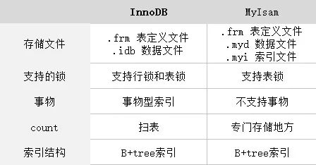
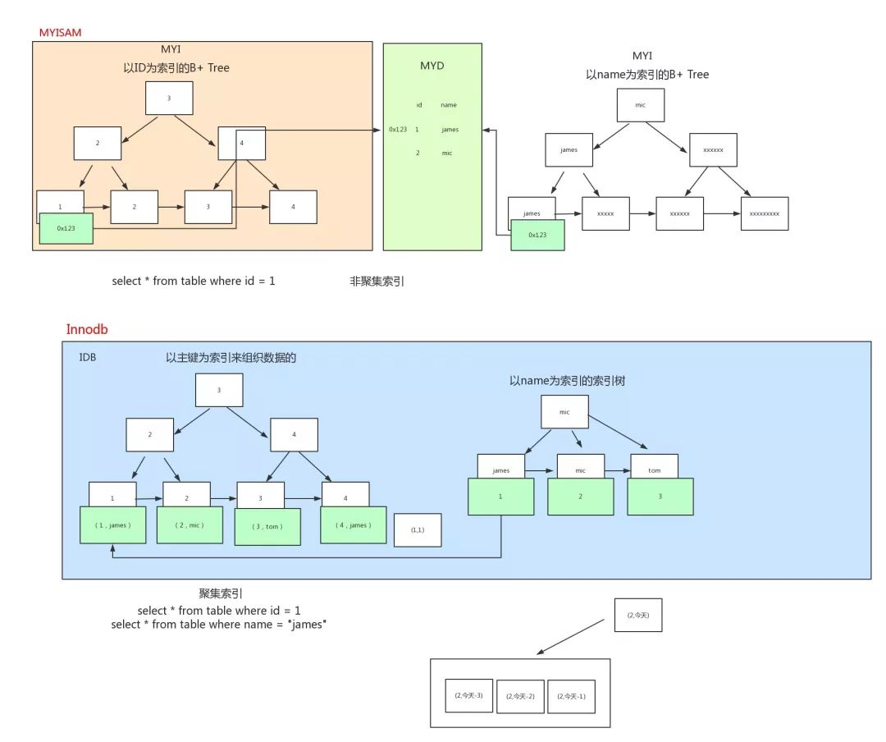

# 为什么MyIsam查询比InnoDB快？

> 2020.03.25 10:09

MyIsam并不一定比InnoDB快。
- MyIsam适用场景：

    读多，并发少

- InnoDB和MyIsam的区别

### 为什么说MyIsam查询快呢？

- *因为索引结构不同*

类别    |索引   |方式
---|---|---
MyIsam  |非聚集索引   |myisam 存储会有两个文件，一个是索引文件，另外一个是数据文件，其中索引文件中的索引指向数据文件中的表数据。
InnoDB  |根据主键进行展开的聚集索引    |聚集型索引并不是一种单独的索引类型，而是一种存储方式，InnoDB 聚集型索引实际上是在同一结构中保存了 B+tree 索引和数据行。当有聚集索引时，它的索引实际放在叶子页中。

结合上图，可以看出：INNODB 在做 SELECT 的时候，要维护的东西比 MYISAM 引擎多很多。

> MVCC(多版本并发控制)

InnoDB：通过为每一行记录添加两个额外的隐藏的值来实现 MVCC

这两个值一个记录这行数据何时被创建，另外一个记录这行数据何时过期（或者被删除）。

但是 InnoDB 并不存储这些事件发生时的实际时间，相反它只存储这些事件发生时的系统版本号。

这是一个随着事务的创建而不断增长的数字。

每个事务在事务开始时会记录它自己的系统版本号。

每个查询必须去检查每行数据的版本号与事务的版本号是否相同。

让我们来看看当隔离级别是 REPEATABLEREAD 时这种策略是如何应用到特定的操作的：

SELECT InnoDB 必须每行数据来保证它符合两个条件：

> 参考链接:[https://blog.csdn.net/xmtblog/article/details/87941698](https://blog.csdn.net/xmtblog/article/details/87941698)